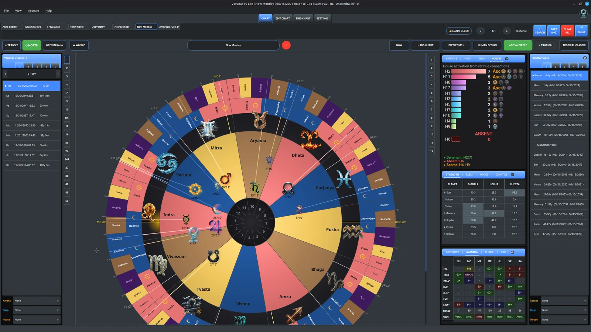

# Varuna360 Core

**Tropical Vedic astrology, open-sourced.**

Varuna360 Core is the free, open-source foundation of Varuna360 — a desktop
astrology application that computes and visualizes charts in **Tropical,
Sidereal, and Aditya Circle** modes with Vedic concepts (Adityas,
Nakshatras, Vedic mythology). The author practices Tropical astrology,
but the software computes both Tropical and Sidereal with full ayanamsa
support. It is the same calculation engine that powers the Pro edition.

[](https://www.gnu.org/licenses/agpl-3.0)
[](https://360heartsinthesky.com/subscribe)



> **[Read the full manual](docs/help/manual.html)** for a complete walkthrough of every feature.

---

## Built on libaditya

Varuna360 Core is built on top of
[**libaditya**](https://gitlab.com/ninthhouse/libaditya), an astrological
calculation library created by Josh
([ninthhouse](https://gitlab.com/ninthhouse)). His work on libaditya gave
this project a solid, well-structured foundation for tropical, sidereal,
and Aditya zodiac calculations, divisional charts, Vimshottari Dasha,
Jaimini techniques, Human Design bodygraphs, Cards of Truth, and more.
Without his library, Varuna360 would not have the calculation backbone it
has today.

Many features inside libaditya do not yet have a GUI in Varuna360, but
they are fully functional from the command line or through an AI assistant.
If you have a Claude or ChatGPT/Codex subscription and know how to work
with AI, you can use libaditya's Python API directly to explore chart
calculations, vargas, dignities, and other techniques that the desktop
interface does not yet cover.

Josh has also created several mobile astrology apps. You can find them
across his various repositories on
[GitLab](https://gitlab.com/ninthhouse).

## What's in Core

- Every paid Core feature runs fully from source with no account
- Full interactive wheel chart with clickable planets and signs showing detailed descriptions
- 3 chart styles: Wheel, South Indian, North Indian
- Light and dark themes with color presets
- 3 zodiac configurations: Aditya Circle (from Ernst Wilhelm's new research), Tropical Western, and Sidereal, with many ayanamsa options
- Human Design mode (computes the astrology layer of Human Design, bodygraph coming in a later update)
- Divisional charts (Varga D1 to D60)
- Trimsamsa and Hora panels with full chart creation (from Ernst Wilhelm's Aditya retinue course)
- Interactive Vimshottari Dasha timeline
- CHTK file import and export (Kala compatibility)
- Automatic chart download from the web (Wikipedia biography search)
- Chart editing with interactive map
- Find Chart: search your chart database by planetary positions in any zodiac mode
- User profiles (like Chrome) to save charts in memory
- Autosave and Autoload, never lose your chart data again
- 16 Tajika aspects and Yoga detection plus Vedic planetary aspects
- Avastha relationship analysis (help and damage between planets)
- Element and Modality breakdown with pie charts
- Planetary strength (Shadbala) and Karakas panels
- Available on Windows and Linux (Mac coming later)

## What's in Varuna360 Pro

Pro is a separate, proprietary edition with new screens, advanced research
tools, and features being added over time. It is **not** in this repository
and Core never imports from it. If you want any of these, see
[Varuna360 Pro](https://360heartsinthesky.com/subscribe):

- All Core features
- Full transit screen with real-time tracking
- Eclipse and Saros panel: per-country Ascendant map plus historical Saros cycle research
- Solar return screen
- AI-assisted chart interpretation
- Psychological pattern and trauma detection (Lajitadi)
- Element and Modality statistical analysis
- Chinese Lunar New Year tab
- Nakshatra wheel with innovative display options
- Birth Finder: reverse-engineer charts from planetary positions
- Pattern searching across time and databases
- Planet Ingress and Conjunction finder
- New features added regularly

## Pricing

Varuna360 Core runs fully from this repository under AGPL-3.0 — no
account, no payment, no server call at launch. The desktop app is a
legitimate product you can test for free for as long as you want.
When you decide it is worth paying for, the website offers three
account tiers that unlock content on the web app.

### Website tiers

| Tier               | Price                        | Website access                                                                 |
|--------------------|------------------------------|---------------------------------------------------------------------------------|
| No account         | €0                           | Natal chart calculation, manual entry, element pie charts plus positions table, dominant Aditya description, Ascendant plus House Strength |
| Registered free    | €0                           | All No account features plus celebrity database, transit ring (current planets), 2 save slots |
| Explorer           | €9.99 / month                | All Registered free features plus CHTK file import, full transit calculation plus Now button, Dignified Planets panel, Divine Cow (Kamadhenu) panel, Planet Strength (Shadbala) panel, 20 save slots |

### Desktop distribution

| Distribution       | Price                        | What you get                                                                   | Status      |
|--------------------|------------------------------|---------------------------------------------------------------------------------|-------------|
| Source (this repo) | €0                           | Every Core feature, AGPL-3.0, clone and build                                  | Available   |
| Bundled installer  | From €1 / month, suggested €14.99 / month | Same Core features as source plus pre-built installer, auto-updates, email help, matching website tier | Coming Soon |
| Pro                | €29.99 / month               | Everything in Core plus the "What's in Varuna360 Pro" list above               | Coming Soon |

Every paid tier is a monthly recurring subscription. Paying €9.99 /
month or more also includes the Explorer website tier. Paying less
than €9.99 / month grants a partial-access tier on the website.
Pricing is shown in EUR. The bundled installer and Pro subscription
will go live on [360heartsinthesky.com](https://360heartsinthesky.com)
when ready. Source self-host remains free forever under AGPL-3.0.

## Running from source

```bash
git clone https://github.com/astrologielorris/varuna360-core.git
cd varuna360-core
python3 -m venv venv
source venv/bin/activate          # Windows: venv\Scripts\activate
pip install -r requirements.txt
python apps/core_gui_qt.py
```

You'll need the Swiss Ephemeris data files in `ephe/`. They are bundled
with this repository.

## License

Varuna360 Core is licensed under the **GNU AGPL v3.0**. See
[`LICENSE`](LICENSE) for the full text and [`NOTICE`](NOTICE) for copyright
and commercial-exception information. The author, Lorris Turpin, holds the
copyright and retains a commercial exception for the Pro edition.

## Contributing

This repository is a **read-only mirror** of an internal canonical
codebase. Direct pull requests are **not accepted at this time.** Please
see [`CONTRIBUTING.md`](CONTRIBUTING.md) for how to report bugs and
propose patches.

## Security

To report a security vulnerability, see [`SECURITY.md`](SECURITY.md).
**Do not** open a public GitHub issue for security reports.

## Links

- **Website:** https://360heartsinthesky.com
- **Upgrade to Pro:** https://360heartsinthesky.com/subscribe
- **Issues:** https://github.com/astrologielorris/varuna360-core/issues
