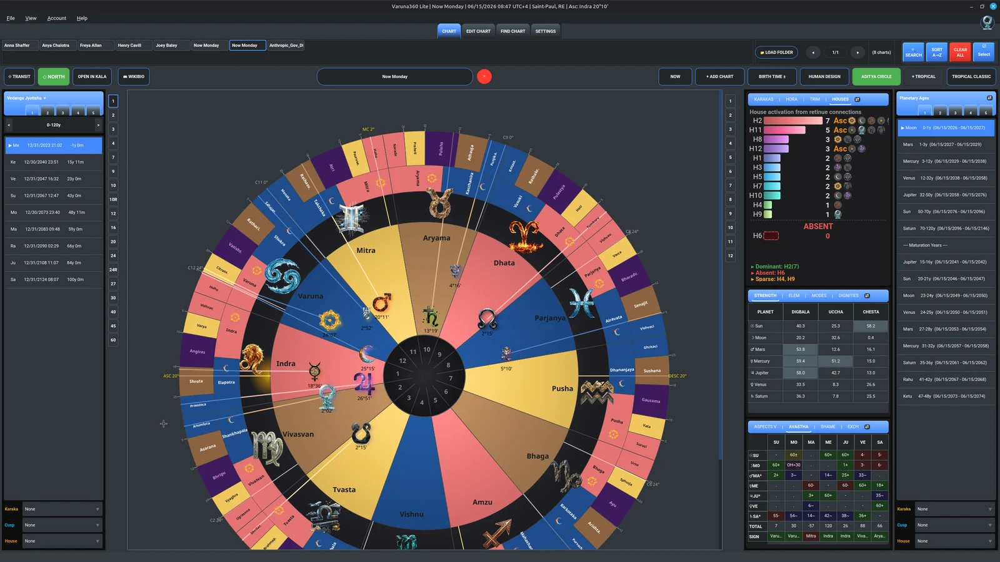

# Varuna360 Core

**Tropical Vedic astrology, open-sourced.**

Varuna360 Core is the free, open-source foundation of Varuna360, a desktop
astrology application that computes and visualizes charts in **Tropical,
Sidereal, and Aditya Circle** modes with Vedic concepts (Adityas,
Nakshatras, Vedic mythology). The author practices Tropical astrology,
but the software computes both Tropical and Sidereal with full ayanamsa
support. It is the same calculation engine that powers the Pro edition.

[](https://www.gnu.org/licenses/agpl-3.0)
[](https://360heartsinthesky.com/subscribe)



> **[Read the full manual](docs/help/manual.html)** for a complete walkthrough of every feature.

---

## Built on libaditya

Varuna360 Core is built on top of
[**libaditya**](https://gitlab.com/ninthhouse/libaditya), an astrological
calculation library created by Josh
([ninthhouse](https://gitlab.com/ninthhouse)). His work on libaditya gave
this project a solid, well-structured foundation for tropical, sidereal,
and Aditya zodiac calculations, divisional charts, Vimshottari Dasha,
Jaimini techniques, Human Design bodygraphs, Cards of Truth, and more.
Without his library, Varuna360 would not have the calculation backbone it
has today.

Many features inside libaditya do not yet have a GUI in Varuna360, but
they are fully functional from the command line or through an AI assistant.
If you have a Claude or ChatGPT/Codex subscription and know how to work
with AI, you can use libaditya's Python API directly to explore chart
calculations, vargas, dignities, and other techniques that the desktop
interface does not yet cover.

Josh has also created several mobile astrology apps. You can find them
across his various repositories on
[GitLab](https://gitlab.com/ninthhouse).

## What's in Core

- Every paid Core feature runs fully from source with no account
- Full interactive wheel chart with clickable planets and signs showing detailed descriptions
- 5 chart views: Wheel, South Indian, North Indian, Body Graph and Cards of Truth
- Two South Indian styles: a new conventional vector chart, or the classic artistic one
- Cards of Truth as its own view, and as an index drawn inside the wheel, the South Indian and the North Indian charts
- A second chart overlaid on the first, shown in the centre of the chart itself, so any two-chart comparison stays in one view
- Fullscreen on any chart with the `F` key, the way a video player does it
- Light and dark themes with color presets, plus a saturation slider to tone the whole interface
- 3 zodiac configurations: Aditya Circle (from Ernst Wilhelm's new research), Tropical Western, and Sidereal, with many ayanamsa options
- Human Design mode (computes the astrology layer of Human Design, bodygraph coming in a later update)
- Divisional charts (Varga D1 to D60)
- Trimsamsa and Hora panels with full chart creation (from Ernst Wilhelm's Aditya retinue course)
- Interactive Vimshottari Dasha timeline
- CHTK file import and export (Kala compatibility)
- Automatic chart download from the web (Wikipedia biography search)
- Chart editing with an interactive themed map that shows the timezone and the Ascendant a place produces before you apply it
- Find Chart: search your chart database by planetary positions in any zodiac mode
- User profiles (like Chrome) to save charts in memory
- Autosave and Autoload, never lose your chart data again
- 16 Tajika aspects and Yoga detection plus Vedic planetary aspects
- Nabhasa Yogas panel: the twenty Akriti yogas detected, drawn and described
- Avastha relationship analysis (help and damage between planets), with refined strength, positive and negative rows split out, and its own fullscreen page
- Element and Modality breakdown with pie charts
- Per-area font sizes, so the chart, the tables and the panels scale independently of the interface
- Planetary strength (Shadbala) and Karakas panels
- Available on Windows, Linux and Mac

## What's in Varuna360 Pro

Pro is the larger paid edition, with new screens, advanced research tools,
and features being added over time. It is AGPL-3.0 too, like everything else
in Varuna360: Pro subscribers receive its corresponding source. It is simply
**not** published in this repository, and Core never imports from it. If you
want any of these, see
[Varuna360 Pro](https://360heartsinthesky.com/subscribe):

- All Core features
- Full transit screen with real-time tracking
- Eclipse and Saros panel: per-country Ascendant map plus historical Saros cycle research
- Solar return screen
- AI-assisted chart interpretation
- Psychological pattern and trauma detection (Lajitadi)
- Element and Modality statistical analysis
- Chinese Lunar New Year tab
- Nakshatra wheel with innovative display options
- Birth Finder: reverse-engineer charts from planetary positions
- Pattern searching across time and databases
- Planet Ingress and Conjunction finder
- New features added regularly

## Pricing

Varuna360 Core runs fully from this repository under AGPL-3.0, with no
account, no payment, no server call at launch. The desktop app is a
legitimate product you can test for free for as long as you want.
When you decide it is worth paying for, the website offers three
account tiers that unlock content on the web app.

### Website tiers

| Tier               | Price                        | Website access                                                                 |
|--------------------|------------------------------|---------------------------------------------------------------------------------|
| No account         | €0                           | Natal chart calculation, manual entry, element pie charts plus positions table, dominant Aditya description, Ascendant plus House Strength |
| Registered free    | €0                           | All No account features plus celebrity database, transit ring (current planets), 2 save slots |
| Explorer           | €9.99 / month                | All Registered free features plus CHTK file import, full transit calculation plus Now button, Dignified Planets panel, Divine Cow (Kamadhenu) panel, Planet Strength (Shadbala) panel, 20 save slots |

### Desktop and mobile distribution

| Distribution       | Price                        | What you get                                                                   | Status      |
|--------------------|------------------------------|---------------------------------------------------------------------------------|-------------|
| Source (this repo) | €0                           | Every Core feature, AGPL-3.0, clone and build                                  | Available   |
| Lite Mobile        | From €3 / month              | The Aditya wheel on Android: Hora and Trimsamsa rings, Avastha, 16 Tajika aspects, live transits and live Ascendant | Available |
| Lite Desktop       | From €3 / month, suggested €14.99 / month | Same Core features as source plus pre-built installer, auto-updates, email help, matching website tier | Coming Soon |
| Pro                | €29.99 / month               | Everything in Core plus the "What's in Varuna360 Pro" list above               | Coming Soon |

Every paid tier is a monthly recurring subscription, priced in EUR.

**You choose what you pay.** Lite Desktop and Lite Mobile use a slider
starting at €3 / month. €14.99 is what the author suggests, not a gate:
salaries are not the same everywhere, and there is no proof to provide and
no country box to tick. Pay what your situation allows, and adjust later if
it changes.

Two thresholds are worth knowing. From €9.90 / month, Lite Desktop includes
the mobile app. From €11 / month, it also includes the Explorer website
tier; below €11 the two subscriptions simply coexist.

**The €29.99 Pro price is not final.** Pro is still growing, and the price
may change as it does. Treat it as the current intent rather than a
commitment.

The bundled installers and the Pro subscription go live on
[360heartsinthesky.com](https://360heartsinthesky.com) when ready. Building
from this source stays free forever under AGPL-3.0.

## Running from source

```bash
git clone https://github.com/astrologielorris/varuna360-core.git
cd varuna360-core
python3 -m venv venv
source venv/bin/activate          # Windows: venv\Scripts\activate
pip install -r requirements.txt
python apps/core_gui_qt.py
```

You'll need the Swiss Ephemeris data files in `ephe/`. They are bundled
with this repository.

## License

The whole of Varuna360 is licensed under the **GNU AGPL v3.0**, Core and Pro
alike. Pro is a paid edition, not a proprietary one. See [`LICENSE`](LICENSE)
for the full text and [`NOTICE`](NOTICE) for copyright details. The author,
Lorris Turpin, holds the copyright and, as sole copyright holder, reserves
the right to license his own code under other terms as well. That reservation
does not affect the AGPL-3.0 grant on the copy you have.

## Contributing

This repository is a **read-only mirror** of an internal canonical
codebase. Direct pull requests are **not accepted at this time.** Please
see [`CONTRIBUTING.md`](CONTRIBUTING.md) for how to report bugs and
propose patches.

## Security

To report a security vulnerability, see [`SECURITY.md`](SECURITY.md).
**Do not** open a public GitHub issue for security reports.

## Links

- **Website:** https://360heartsinthesky.com
- **Upgrade to Pro:** https://360heartsinthesky.com/subscribe
- **Issues:** https://github.com/astrologielorris/varuna360-core/issues

---

<!-- RELEASE-BLOCK:BEGIN -->
<!-- Generated at sync time from VERSION + CHANGELOG.md. Edits here are
     overwritten on the next sync; edit CHANGELOG.md instead. -->

## Current release: 4.4.2 (2026-08-14)

A note on Cards of Truth: the view works and is ready to explore, but it is
still early in its testing cycle, and the timing periods may contain slight
errors. This version ships now because of the other improvements it carries;
refinements to the Cards of Truth timing will follow in a coming release.

### Added

- **Cards of Truth inside the wheel.** Every sign can show the card of its
  ruling planet directly in the wheel and in the South and North Indian
  charts, so the card index reads without leaving the chart. Probably the
  most important update of this release.
- **Full-size chart overlay.** The second chart is no longer a miniature:
  it overlays the current chart at full size. You can overlay a varga chart
  on top of the D1, and overlay a Vimshottari transit date on top of the
  current chart in one click.
- **Avastha reworked.** The panel is recalculated and rebuilt, and double
  clicking opens a much better view: descriptions, help, cleaner visuals,
  and many more details.
- **A new Yogas screen** covering exchange yogas and the Nabhasa yogas,
  each with its diagram and description.
- **Tajika yogas**: a calculation bug fixed and a better presentation.
- **Colour saturation control**, a feature requested by a member: tone the
  whole interface down or up in one move without leaving your theme.

### Fixed

- On macOS, "Move a chart to another profile" did nothing when clicked.
- The right-click menu on Nisarga dasha rows was permanently greyed out.
- The chart folder chosen during first-run setup was not applied.
- The South Indian chart now defaults to the conventional style.

Questions and bug reports: astrologielorris@gmail.com

Earlier releases are in [CHANGELOG.md](CHANGELOG.md).

<!-- RELEASE-BLOCK:END -->
